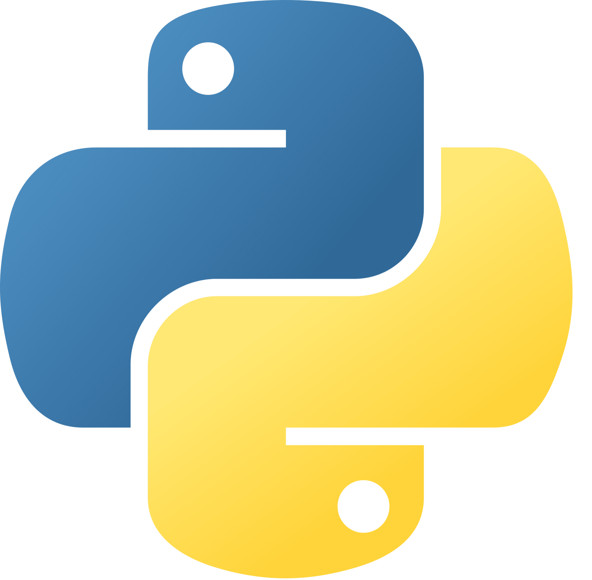

# Project Name

> 🚧 **This project is heavily under construction!** 🚧 \
> As excited as you may be, I don't recommend you to use the app for now. Nevertheless if you wish to contribute, you are welcome to do so by opening an issue or a pull request or even to [contact me](#contact) directly.

**Project Name** has been thought of as a tool to correct your gestures when doing strength-training or body-building. The objectives are to:

- 💪 Optimize muscle activation
- 🤕 Prevent injuries
- 🚀 Rocket your progresses 

<!-- | Image | Name | Role | Contact |
| --- | --- | --- | --- |
|  | Quentin CLÉMENT | Project Owner | [GitHub](https://github.com/Quentin-Clement) \| [LinkedIn](https://www.linkedin.com/in/quentin-clément-939110221/) |
|  | ALGOSUP | Collaborators/Client | [Website](https://www.algosup.com/) \| [LinkedIn](https://www.linkedin.com/company/algosup/) | -->

## Technologies used

**Project Name** is a mix of 2 main technologies: 
-  Swift for the front-end and back-end of the app (*meaning that it is currently only avaible on IOS*).
-  Python 3 and   TensorFlow for the machine learning part.

## Contact

If for any reason you need to contact me, you can do so via [GitHub](https://github.com/Quentin-Clement), [LinkedIn](https://www.linkedin.com/in/quentin-clément-939110221/) or by email at: quentin.clement@algosup.com

## Important Links and Docs

A documentation will be implemented as soon as possible. For now, you can find information in the following documents:
- [Project Charter](./documents/project-charter.md)
- [Functional Specifications](./documents/functional-specifications.md)
- [Technical Specifications](./documents/technical-specifications.md)

## Contributors

  

<<<<<<< Updated upstream
AI is a very complex field and I don't have a lot of experience in it. I will have to create my model from scratch and I will have to work on it for a long time. I will train it with as much data as possible (this data will be Instagram photos that I will have to collect and filter myself). I will then have to test it and either improve it by modifying the model or by adding more training data.  

To provide the user with the best experience possible, I will have to make the AI search in the Instagram database for each sneaker. When the user enters his model in the application, it will return the result of the search that is been made before by the AI Searching in the whole Instagram database is a very long process I can't do with my computer, I will have to pay for other computers to do it.  

In addition to being very long, it will also be very expensive. I can't afford that amount of money that's why I'm searching for sponsors/partners.  

### b. The clothes recognition

Clothes recognition is a whole different part. A second AI will now have to find what are the references to the clothes in the photos.  
I can't have a database of all clothes in the world so I will have to work with a limited number of clothes, the clothes of my partner.  
If in the photo where your sneakers appear the second AI doesn't recognize any clothing of my partner, it will only return the photo. But if it recognizes the clothe of my partner, it will return the photo and the reference of the clothing.   

Still, to provide the best experience possible, I will have to make the second AI search in each photo of each sneakers model if there is a clothing of my partner. It will add time to the process that's why it's better to do it before the user enters his model in the application.  

The clothes recognition is a point I didn't make up my mind about yet. It's not my priority at all, I have a global idea of how I want it to be but I don't know if it's the best way to do it. I will have to think more about it with my partner in the future for a second version.  

## 4. Partnerships

I will have to do a business plan to know how much money I will need to develop the project.  

I'm currently looking for partnerships with brands making sneakers. It could be a good way for them to promote their brand and their products by combining fashion and social networks, two fields very developed for the young audience. In my opinion, it's a very profitable market for them. Expanding further in this sector would undoubtedly allow them to make profits.  

I'm sure that some brands will be interested in this project and will be ready to help me to develop it but unfortunately, I don't have any contacts in this field and it's complicated to contact them to discuss a partnership.  

## 2. What to do for the first version?

Find one partner and one model of this brand to start building my model.  
Build the model, train it, and test it. Make the AI search in the whole Instagram database (the most time-consuming step).   
Build a short application and connect it to the AI.  

## 3. What should be the biggest challenges to overcome?

In my opinion, there are three main challenges to overcome:  
- The first one is AI. As I previously said, it is the most important part of the project but it's also the most complex, long, and expensive part of this project. I'm not very competent in this field and I will have to learn a lot of things to be able to build a good model.  
- The second one is the business plan, I need to evaluate the cost of this project but also how much I estimate it will generate in the future. I don't have any experience in this field so either I will learn it by myself or I will have to find someone who can help me with this part of the project.  
- The third one is finding a partner. I don't have any experience in business and marketing, so it seems very complicated to contact a brand and discuss a partnership around this project.  

## 4. Conclusion

The goal of this project is to start from a little audience and by using the feedback of the users on the first version, improve the application and contact more partners to add their products to the application, bring more users with these new products, and so on.  
It's a complete project that mixes different fields such as web development, design, AI, business, and marketing.  
I wish to extend my knowledge and my network by making a project I really enjoy and that I'm passionate about.  
=======
>>>>>>> Stashed changes
