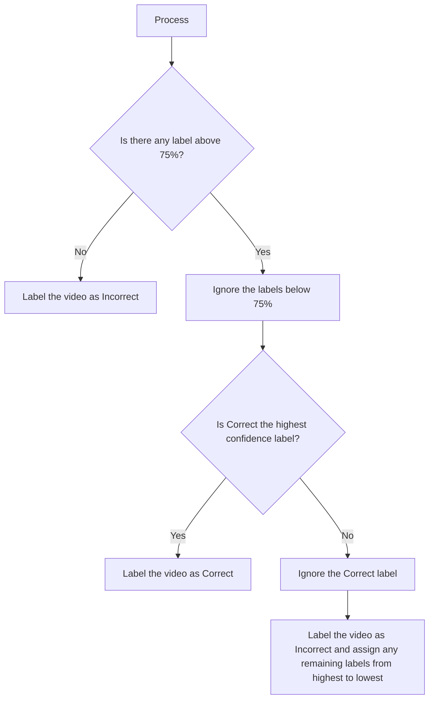
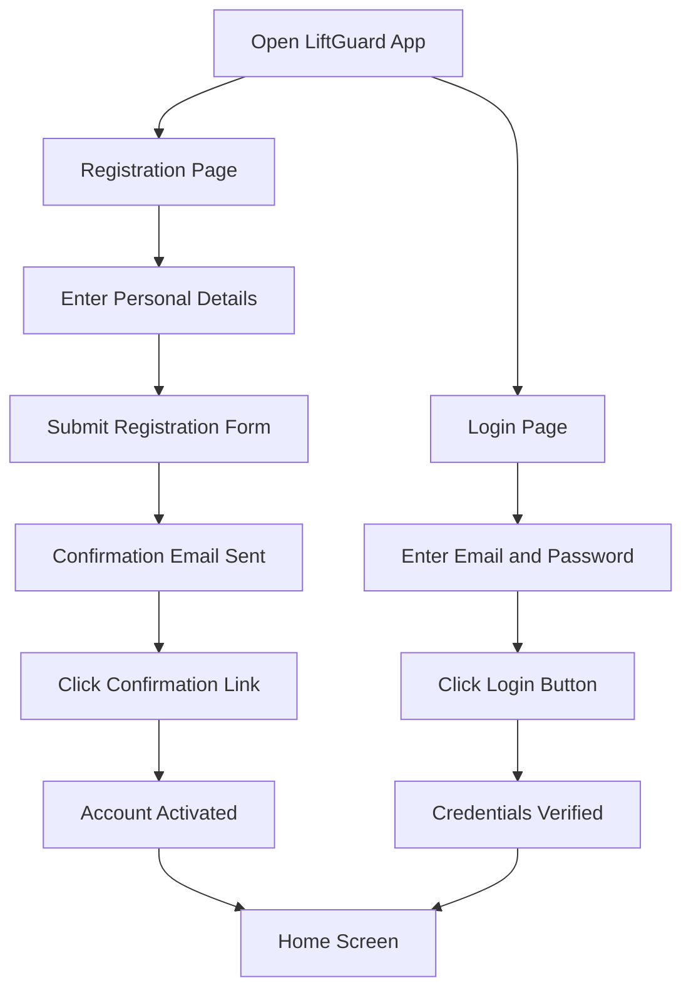

# Functional Specification

### Table of Contents
- [Functional Specification](#functional-specification)
    - [Table of Contents](#table-of-contents)
  - [1. Introduction](#1-introduction)
    - [1.1 Project Overview](#11-project-overview)
    - [1.2 Executive Summary](#12-executive-summary)
    - [1.3 Purpose and Scope](#13-purpose-and-scope)
    - [1.4 Intended Audience](#14-intended-audience)
    - [1.5 Milestones and Deliverables](#15-milestones-and-deliverables)
    - [1.6 Glossary](#16-glossary)
  - [2. Personas and Use Cases](#2-personas-and-use-cases)
    - [2.1 Personas](#21-personas)
      - [➭ 2.1.1 Victor - The newbie](#-211-victor---the-newbie)
      - [➭ 2.1.2 Fabrice - The experienced](#-212-fabrice---the-experienced)
      - [➭ 2.1.3 Tiffany - The athlete](#-213-tiffany---the-athlete)
      - [➭ 2.1.4 Brutia - The influencer](#-214-brutia---the-influencer)
    - [2.2 Use Cases](#22-use-cases)
  - [3. Functional Requirements](#3-functional-requirements)
    - [3.1 Artificial Intelligence Model](#31-artificial-intelligence-model)
      - [➭ 3.1.1 Overview](#-311-overview)
      - [➭ 3.1.2 Dataset](#-312-dataset)
      - [➭ 3.1.3 Input](#-313-input)
      - [➭ 3.1.4 Output](#-314-output)
    - [Output Process Flowchart](#output-process-flowchart)
    - [3.2 Mobile Application](#32-mobile-application)
      - [➭ 3.2.1 Overview](#-321-overview)
      - [➭ 3.2.2 User Registration and Authentication](#-322-user-registration-and-authentication)
      - [➭ 3.2.3 Login](#-323-login)
      - [➭ 3.2.4 Home Screen](#-324-home-screen)
      - [➭ 3.2.5 Progress Monitoring](#-325-progress-monitoring)
      - [➭ 3.2.6 Tutorial Section](#-326-tutorial-section)
      - [➭ 3.2.7 Profile Management](#-327-profile-management)
      - [➭ 3.2.8 Export Video](#-328-export-video)
      - [➭ 3.2.9 Notifications](#-329-notifications)
      - [➭ 3.2.10 User Workflow](#-3210-user-workflow)
  - [4 Non-Functional Requirements](#4-non-functional-requirements)
    - [4.1 Data Security](#41-data-security)
    - [4.2 App Performance and Time Responsiveness](#42-app-performance-and-time-responsiveness)

---

## 1. Introduction

### 1.1 Project Overview
**Project Name:**
LiftGuard

**Document Title:**
Functional Specification

**Version:**
0.1

**Date:**
June 21, 2024

**Author(s):**
- Quentin CLÉMENT (Project Owner)

---

### 1.2 Executive Summary
**LiftGuard** is a project aimed at correcting users' gestures when doing powerlifting or bodybuilding. The objectives are to:
- Optimize muscle activation
- Prevent injuries
- Accelerate progress

This document outlines the functional specifications of the **LiftGuard** project, detailing the requirements, use cases, and technologies used to ensure effective development and implementation.

> 🚧 **Note:** The content of this document evolves over time as the project's scope changes and expands with each new version.

---

### 1.3 Purpose and Scope
**Purpose:**
This document serves as a guide for the development and implementation of the **LiftGuard** project, outlining the functional requirements and specifications to be met.

**Scope:**
Develop a mobile application available on iOS and Android platforms. This application includes an AI model that analyzes the video provided by the user and gives feedback on the user's gestures. Initially, the AI model will focus on analyzing squats only. New models for other exercises will be added in future phases.

---

### 1.4 Intended Audience
This document is used as a reference for the development team, including tech lead, developers, and testers, to ensure that the **LiftGuard** project meets the functional requirements and specifications outlined herein, and also for future maintenance and updates.

---

### 1.5 Milestones and Deliverables

**Project Phases:**
- **Phase 1:** Concludes on September 11th, 2024, with a presentation to a jury.
- **Phase 2:** Begins with the beta release, focusing on maintenance, additional features, and publishing the application on various app stores to engage users. This phase includes a presentation to another jury at an undetermined date, showcasing project evolution and user feedback.
- **Phase 3:** Concludes with the final release of the application.

**Milestones:**
- **Functional Specification Document (Version 1.0)** - June 28, 2024
- **Technical Specification Document (Version 1.0)** - July 5, 2024
- **Artificial Intelligence Model (Version 1.0)** - August 2, 2024
- **Mobile Application (Beta Version)** - August 23, 2024
- **Jury Presentation (Phase 1)** - September 11, 2024
- **Beta Release on App Stores** - TBD
- **User Feedback Collection** - TBD
- **Final Jury Presentation (Phase 2)** - TBD
- **Final Application Release** - TBD

**Deliverables:**
- Functional Specification Document
- Technical Specification Document
- Mock-ups of the application
- Source Code and AI model for gesture analysis
- Source Code for the mobile application
- User Manual
- Final presentation of the project

---

### 1.6 Glossary

| Term/Acronym | Definition                     |
|--------------|--------------------------------|
| API          | Application Programming Interface |
| UX           | User Experience                |
| DB           | Database                       |

---

## 2. Personas and Use Cases

### 2.1 Personas

#### ➭ 2.1.1 Victor - The newbie

#### ➭ 2.1.2 Fabrice - The experienced

#### ➭ 2.1.3 Tiffany - The athlete

#### ➭ 2.1.4 Brutia - The influencer

---

### 2.2 Use Cases

| **Use Case**            | **Description**                                              | **Actors** | **Preconditions**                                                | **Flow**                                                                                                                                  | **Postconditions**                            |
|-------------------------|--------------------------------------------------------------|------------|------------------------------------------------------------------|------------------------------------------------------------------------------------------------------------------------------------------|-----------------------------------------------|
| **User Registration**   | A new user registers for the **LiftGuard** application.         | User       | The user has downloaded and installed the **LiftGuard** application. | 1. User opens the **LiftGuard** app. 2. User navigates to the registration page. 3. User enters personal details (name, email, password). 4. User completes the registration form and submits. 5. System sends a confirmation email to the user. 6. User clicks on the confirmation link in the email to activate their account. | User account is created and activated.       |
| **User Login**          | An existing user logs into the **LiftGuard** application.        | User       | The user has a registered and activated account.                 | 1. User opens the **LiftGuard** app. 2. User navigates to the login page. 3. User enters email and password. 4. User clicks the login button. 5. System verifies the credentials. 6. User is granted access to their account.                                                          | User is logged in and directed to the home screen. |
| **Upload Exercise Video** | A user uploads a video of their exercise for analysis.      | User       | The user is logged in and has access to the video upload feature.| 1. User navigates to the video upload section. 2. User selects a video from their device. 3. User uploads the video to the system. 4. System processes the video for analysis.                                      | Video is uploaded and ready for AI analysis. |
| **AI Feedback on Exercise** | The AI model provides feedback on the user's uploaded exercise video. | User, AI System | The user has uploaded an exercise video.                         | 1. AI system analyzes the uploaded video. 2. AI system identifies any issues with the user's form or technique. 3. AI system generates feedback. 4. User receives feedback on their exercise performance.                                     | User receives AI-generated feedback on their exercise video. |
| **View Progress and Analytics** | A user views their exercise progress and analytics over time.  | User       | The user has uploaded multiple exercise videos and received feedback. | 1. User navigates to the progress and analytics section. 2. System displays graphical representations of the user's progress. 3. User reviews their performance metrics and improvement over time.                                                | User gains insights into their progress and areas needing improvement. |
| **Set Exercise Goals**  | A user sets personal exercise goals within the application. | User       | The user is logged in.                                           | 1. User navigates to the goals section. 2. User sets specific exercise goals (e.g., improve squat form, increase bench press weight). 3. System saves the user's goals. 4. System tracks progress towards these goals.                               | User's goals are saved and tracked by the system. |
| **Receive Notifications** | The user receives notifications about their progress, reminders, and updates. | User, System | The user is logged in and has notifications enabled.             | 1. System sends notifications about various events (e.g., new feedback, goal progress, app updates). 2. User receives and

 views the notifications.                                                                                                     | User stays informed about their progress and important updates. |
| **Engage with Community** | Users interact with the community to share progress and tips.   | User, Other Users | The user is logged in and has access to the community feature.   | 1. User navigates to the community section. 2. User posts updates, questions, or tips. 3. Other users view and respond to the posts.                                                                                                               | User interacts with the community, gaining support and advice. |
| **User Profile Management** | The user updates their personal profile information.       | User       | The user is logged in.                                           | 1. User navigates to their profile section. 2. User updates personal details (e.g., name, email, password, profile picture). 3. User saves the changes.                                                                                               | User's profile information is updated in the system. |
| **App Settings Configuration** | The user configures app settings such as notification preferences and language. | User       | The user is logged in.                                           | 1. User navigates to the settings section. 2. User adjusts settings (e.g., notification preferences, language options). 3. User saves the settings.                                                                                                 | User's settings are updated and applied.    |

---

## 3. Functional Requirements

### 3.1 Artificial Intelligence Model

#### ➭ 3.1.1 Overview
The AI model in **LiftGuard** is designed to analyze exercise videos uploaded by the user and provide detailed feedback on the user's form and technique. This functionality aims to help users optimize muscle activation, prevent injuries, and accelerate their progress in powerlifting or bodybuilding exercises.

As an initial version (MVP) and potentially until the end of the first phase, the AI model will focus exclusively on analyzing squats. New models for other exercises will be added in future phases.

#### ➭ 3.1.2 Dataset
To train the model and make it as accurate as possible, a dataset of squat videos with correct and incorrect form examples will be required. Each video will be labeled with the specific mistakes made by the user, allowing the AI model to learn and identify these mistakes in new videos. \
Building this dataset will involve asking actual athletes to perform squats with various mistakes, recording these sessions, and labeling the videos accordingly.

#### ➭ 3.1.3 Input
The primary input for the AI model is a video uploaded by the user. The video should clearly capture the user's exercise performance from a side or half-side angle, allowing the AI to accurately assess their form and technique.

Input details:
- Video file uploaded by the user
- Metadata such as the exercise type (initially limited to squats)

#### ➭ 3.1.4 Output

The output of the AI model consists of detailed feedback on the user's exercise performance. This feedback includes:

- An assessment of whether the exercise gesture is correct or incorrect
- Identification of specific mistakes made by the user
- Suggestions for correcting the identified mistakes
- Confidence Score: A value indicating the model's confidence in its assessment, expressed as a percentage or a value between 0 and 1

For a squat, the outputs will be:

- ✅ Correct
- ❌ Knee Cave (Valgus Collapse)
- ❌ Knees Forward
- ❌ Heels Lifting
- ❌ Forward Lean
- ❌ Depth
- ❌ Foot Placement
- ❌ Asymmetrical Movement
- ❌ Improper Bar Placement
- ❌ Overarching the Back

The AI model assigns a label only if it is at least 75% confident in its assessment. If multiple labels are above 75% confidence, all relevant labels are assigned, except if the "Correct" label is also above 75% confidence and higher than any other label, in which case only "Correct" is assigned. If no labels are above 75% confidence, the output is "Incorrect video."

### <u>Output Process Flowchart</u>

The feedback will be presented to the user through the mobile application interface, providing actionable insights to improve their form and technique, along with the confidence score for each assessment.

---

### 3.2 Mobile Application

#### ➭ 3.2.1 Overview
The **LiftGuard** mobile application serves as the primary interface for users to interact with the AI model, upload exercise videos, receive feedback, track progress, set goals, and engage with the community. The application is designed to be user-friendly, intuitive, and engaging, providing a seamless experience for users to optimize their exercise performance.

#### ➭ 3.2.2 User Registration and Authentication
The registration and authentication process ensures secure access to the application while collecting essential user information.

**Fields Required:**
  - Language preference
  - First Name
  - Last Name
  - Email
  - Password
  - Confirm Password
  - Acceptance of Terms and Conditions

**Process:**
  1. User enters required information on the registration page.
  2. System sends a confirmation email to the user.
  3. User confirms email to activate the account.

**Additional Information During Setup:**
  - Fitness Level (Beginner, Intermediate, Advanced) or Experience in years
  - Weight and Height
  - Fitness Goals (e.g., muscle gain, fat loss, strength improvement)
  - Optional: Personal Record (PR) tracking
  - Profile Picture upload

#### ➭ 3.2.3 Login
The login functionality allows users to securely access their accounts.

**Fields Required:**
  - Email
  - Password

**Features:**
  - Forgot Password link for password recovery
  - Remember Me option for easier login
  - Sign Up link for new users

#### ➭ 3.2.4 Home Screen
The home screen provides users with an overview of their progress and easy access to key features.

**Features:**
  - **Current Personal Records (PRs):** Display user's best lifts.
  - **Progress Graph:** Visual representation of progress over time.
  - **Upload Video Button:** Direct access to video upload functionality.

#### ➭ 3.2.5 Progress Monitoring
The application provides tools to track and visualize user progress over time.

**Features:**
  - **Progress Charts:** Graphical representation of improvements in PRs and other metrics.
  - **Performance Metrics:** Detailed analysis of user's performance trends.
  - **Goals Tracking:** Monitor progress towards set fitness goals.

#### ➭ 3.2.6 Tutorial Section
The tutorial section provides instructional content to help users perform exercises correctly.

**Available Tutorials:**
  - Squat Tutorial
  - Bench Press Tutorial
  - Deadlift Tutorial

**Features:**
  - Step-by-step instructions
  - Video demonstrations
  - Common mistakes and tips

#### ➭ 3.2.7 Profile Management
The profile management section allows users to view and edit their personal information and settings.

**Features:**
  - **Personal Information:** View and update name, email, password, weight, height, and fitness goals.
  - **Profile Picture:** Upload or change profile picture.
  - **Fitness Level and Goals:** Update fitness level and goals.
  - **Settings:**
    - Notification preferences (e.g., receive alerts for feedback, progress updates)
    - Language options (e.g., English, French)
  - **Activity Log:** View history of uploaded videos and received feedback.
  - **Privacy Settings:** Control who can view the user's progress and shared content.

#### ➭ 3.2.8 Export Video
Users can export their analyzed exercise videos for sharing or further analysis.

**Features:**
  - **Annotated Video Export:** The exported video will include the AI-generated feedback, with annotations highlighting areas of correct form and mistakes.
  - **Sharing Options:** Users can directly share the exported videos through social media platforms, email, or messaging apps.
  - **Download Options:** Users can download the video to their device for offline access or further analysis.
  - **Watermarking:** Include a **LiftGuard** watermark on exported videos to promote the application.

#### ➭ 3.2.9 Notifications
Keep users informed about their activity and application updates.

**Features:**
  - **Exercise Feedback:** Receive alerts when new feedback is available.
  - **Goal Reminders:** Notifications to remind users of their set goals.
  - **App Updates:** Inform users about new features and updates.

####  ➭ 3.2.10 User Workflow

---

## 4 Non-Functional Requirements

### 4.1 Data Security
Data security is paramount to protect users' personal information and exercise data.

**Measures:**
  - **Encryption:** All data, both at rest and in transit, will be encrypted using industry-standard encryption algorithms (e.g., AES-256).
  - **Authentication:** Implement secure authentication protocols, including OAuth 2.0 and multi-factor authentication (MFA).
  - **Data Anonymization:** Anonymize user data for analysis to ensure privacy.
  - **Access Control:** Use role-based access control (RBAC) to restrict access to sensitive data and functionalities.
  - **Regular Audits:** Conduct regular security audits and vulnerability assessments.

---

### 4.2 App Performance and Time Responsiveness
The performance and responsiveness of the app are critical to providing a smooth user experience.

**Targets:**
  - **Load Time:** Aim for an app load time of under 2 seconds.
  - **Responsiveness:** Ensure all interactions (e.g., button presses, video uploads) respond within 100 milliseconds.
  - **Scalability:** Design the app architecture to handle increasing numbers of users and data without degradation in performance.
  - **Resource Management:** Optimize the app to efficiently use device resources (e.g., CPU, memory) to prevent slowdowns and crashes.

---
