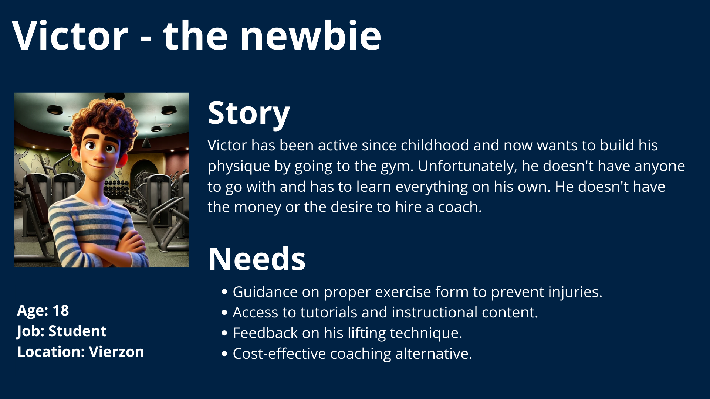
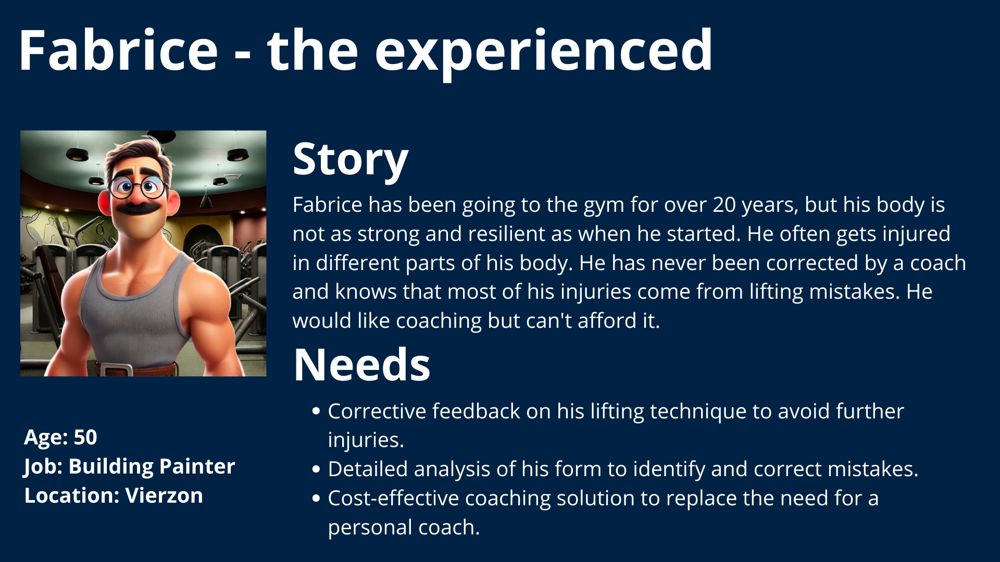
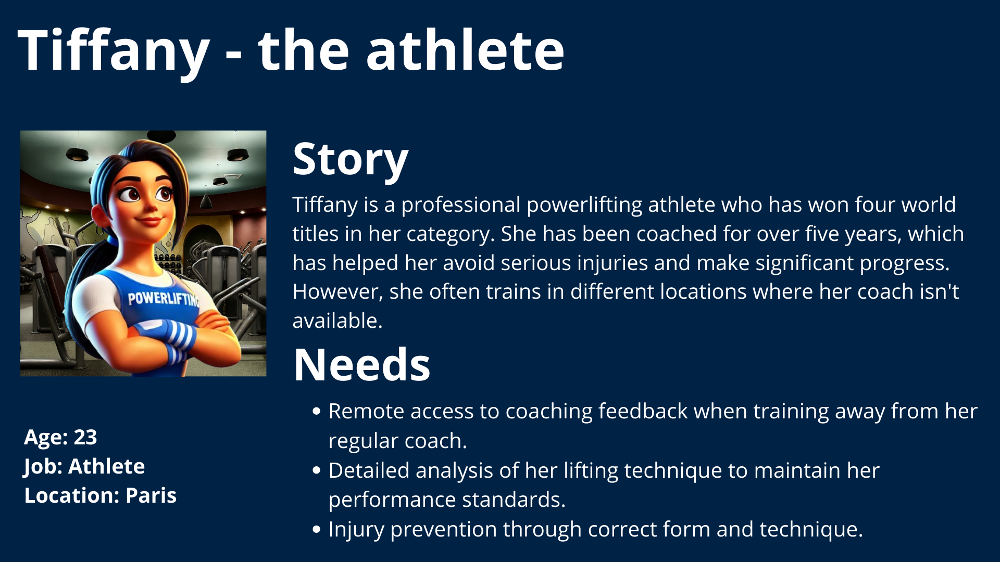
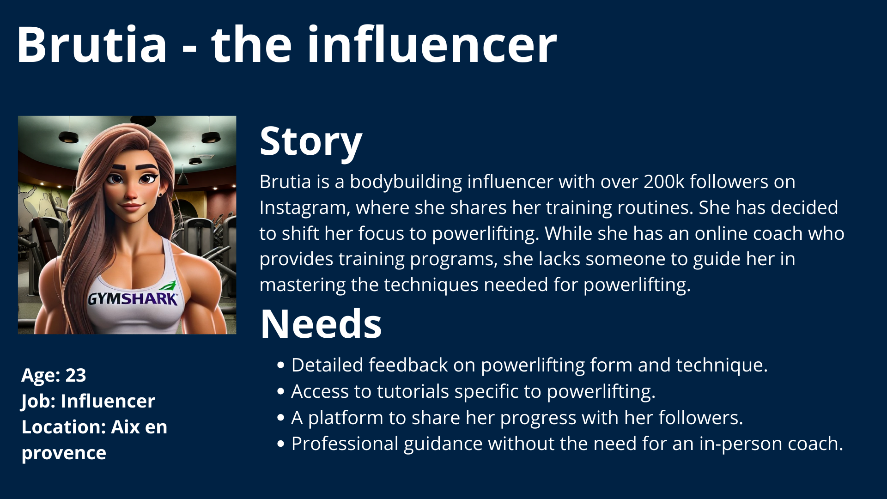
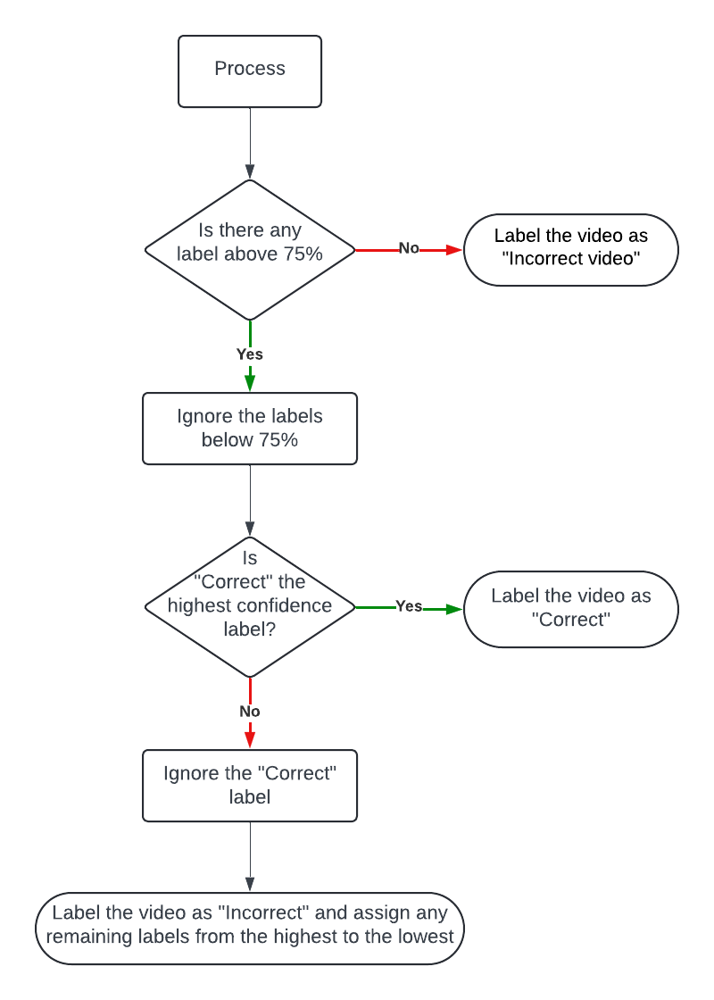
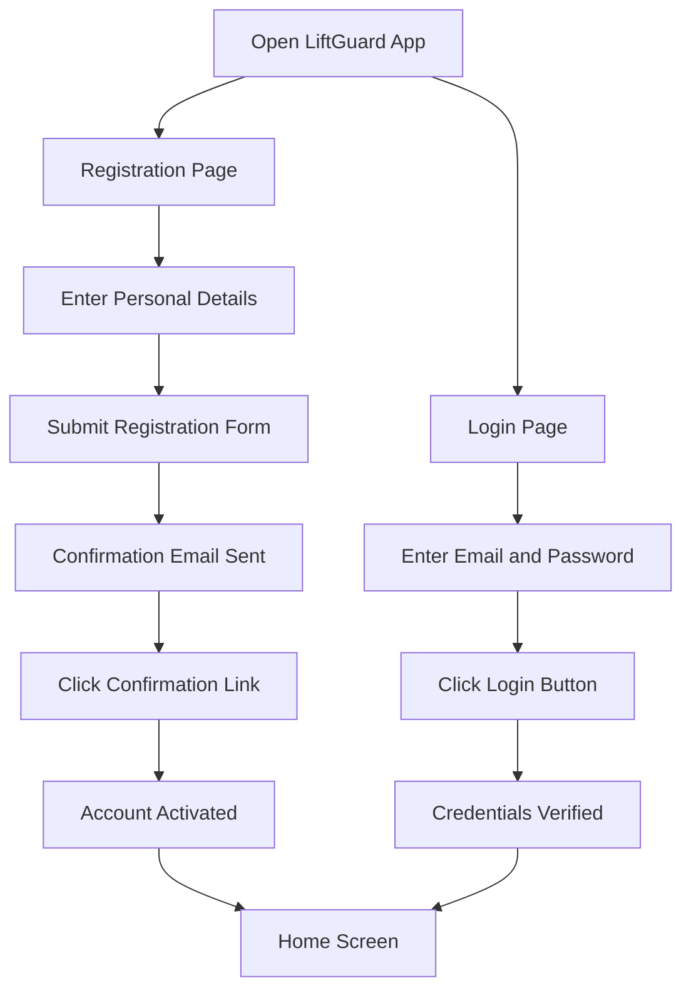
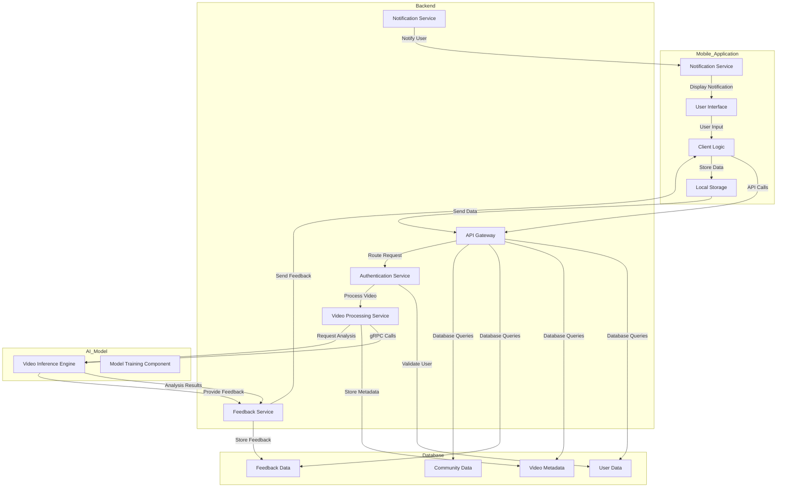

# Report

### Table of Contents

- [Report](#report)
    - [Table of Contents](#table-of-contents)
  - [1. Introduction](#1-introduction)
    - [1.1 The problem](#11-the-problem)
    - [1.2 The solution](#12-the-solution)
    - [1.3 Stakeholders](#13-stakeholders)
    - [1.4 Milestones and Deliverables](#14-milestones-and-deliverables)
  - [2. Project Scope](#2-project-scope)
    - [2.1 The Application](#21-the-application)
      - [➭ 2.1.1 The Marketplace](#-211-the-marketplace)
      - [➭ 2.1.2 The Features](#-212-the-features)
      - [➭ 2.1.3 Included Advertising](#-213-included-advertising)
    - [2.2 The Artificial Intelligence](#22-the-artificial-intelligence)
      - [➭ 2.2.1 The Database](#-221-the-database)
      - [➭ 2.2.2 The Output](#-222-the-output)
  - [3. Personas and Use Cases](#3-personas-and-use-cases)
    - [3.1 Personas](#31-personas)
      - [➭ 3.1.1 Victor - The newbie](#-311-victor---the-newbie)
      - [➭ 3.1.2 Fabrice - The experienced](#-312-fabrice---the-experienced)
      - [➭ 3.1.3 Tiffany - The athlete](#-313-tiffany---the-athlete)
      - [➭ 3.1.4 Brutia - The influencer](#-314-brutia---the-influencer)
    - [3.2 Use Cases](#32-use-cases)
  - [4. Functional Requirements](#4-functional-requirements)
    - [4.1 Artificial Intelligence Model](#41-artificial-intelligence-model)
      - [➭ 4.1.1 Overview](#-411-overview)
      - [➭ 4.1.2 Dataset](#-412-dataset)
      - [➭ 4.1.3 Input](#-413-input)
      - [➭ 4.1.4 Output](#-414-output)
    - [4.2 Mobile Application](#42-mobile-application)
      - [➭ 4.2.1 Overview](#-421-overview)
      - [➭ 4.2.2 User Registration and Authentication](#-422-user-registration-and-authentication)
      - [➭ 4.2.3 Login](#-423-login)
      - [➭ 4.2.4 Home Screen](#-424-home-screen)
      - [➭ 4.2.5 Progress Monitoring](#-425-progress-monitoring)
      - [➭ 4.2.6 Tutorial Section](#-426-tutorial-section)
      - [➭ 4.2.7 Profile Management](#-427-profile-management)
      - [➭ 4.2.8 Export Video](#-428-export-video)
      - [➭ 4.2.9 Notifications](#-429-notifications)
      - [➭ 4.2.10 User Workflow](#-4210-user-workflow)
  - [5. Non-Functional Requirements](#5-non-functional-requirements)
    - [5.1 Data Security](#51-data-security)
    - [5.2 App Performance and Time Responsiveness](#52-app-performance-and-time-responsiveness)
  - [6. System Architecture](#6-system-architecture)
    - [6.1 Overview](#61-overview)
    - [6.2 System Architecture Diagram](#62-system-architecture-diagram)
    - [6.3 Data Preprocessing](#63-data-preprocessing)
    - [6.4 Model Development and Evaluation](#64-model-development-and-evaluation)
      - [➭ 6.4.1 Model Architecture](#-641-model-architecture)
      - [➭ 6.4.2 Model Compilation](#-642-model-compilation)
      - [➭ 6.4.3 Training and Evaluation](#-643-training-and-evaluation)
      - [➭ 6.4.4 Model Evaluation](#-644-model-evaluation)
    - [6.5 Why deep learning?](#65-why-deep-learning)
    - [6.6 Why TensorFlow and MediaPipe?](#66-why-tensorflow-and-mediapipe)
    - [6.7 Why Flutter?](#67-why-flutter)
  - [7. Testing Strategy](#7-testing-strategy)
  - [8. Management](#8-management)
    - [8.1 Planning](#81-planning)
    - [8.2 Actual Performance](#82-actual-performance)
  - [9. Next Steps](#9-next-steps)
    - [9.1 Dataset](#91-dataset)
    - [9.2 Mobile Application](#92-mobile-application)
    - [9.3 Testing Strategy](#93-testing-strategy)
    - [9.4 Deployment](#94-deployment)

## 1. Introduction

### 1.1 The problem

Since my earliest childhood, sport has been a massive pillar of my life. And with time, the hobby became a real ambition of performance. \
To achieve my goals, I had to get the most out of my body while preventing injury. On that task, I was helped by coaches who taught me the right techniques and the right exercises to mix performance and safety. 

Unfortunately, I never went to the Olympics but at least I never got seriously injured. Time flies and for a few years, I started to go to the gym. \
This time, I didn't have a coach and I had to learn by myself. Quickly, the first pains and injuries appeared while my progresses were on the ups and downs. It didn't took me long to understand that my problem was the lack of technique. I would have love to have a coach but I couldn't afford it.

<br>

But then, <u> **How to to correct my technique without a coach?** </u>

---

### 1.2 The solution

At first you can ask people at your gym to give you advice or watch videos on the internet. But it's not always easy to find someone who knows what he's talking about and the internet is full of contradictory information. \
So I thought about a solution. Compare your technique to the one of international athletes.

<u> **But how?** </u> \
An app that will ask you to film yourself while doing an exercise and then compare your video to a whole database of international athletes. It will detect your mistakes and give you advice to correct them.

---

### 1.3 Stakeholders

| Role | Name | Contact |
| --- | --- | --- |
| Project Owner | Quentin CLÉMENT | [GitHub](https://github.com/Quentin-Clement) / [LinkedIn](https://www.linkedin.com/in/quentin-clément-939110221/) |
| Collaborator/Final Addressee | ALGOSUP | [Website](https://www.algosup.com/) / [GitHub](https://github.com/algosup) / [LinkedIn](https://www.linkedin.com/company/algosup/) |

---

### 1.4 Milestones and Deliverables

**Project Phases:**
- **Phase 1:** Concludes on September 11th, 2024, with a presentation to a jury.
- **Phase 2:** Begins with the beta release, focusing on maintenance, additional features, and publishing the application on various app stores to engage users. This phase includes a presentation to another jury at an undetermined date, showcasing project evolution and user feedback.
- **Phase 3:** Concludes with the final release of the application.

**Milestones:**
- **Functional Specification Document (Version 1.0)** - June 28, 2024
- **Technical Specification Document (Version 1.0)** - July 5, 2024
- **Artificial Intelligence Model (Version 1.0)** - August 2, 2024
- **Mobile Application (Beta Version)** - August 23, 2024
- **Jury Presentation (Phase 1)** - September 11, 2024
- **Beta Release on App Stores** - TBD
- **User Feedback Collection** - TBD
- **Final Jury Presentation (Phase 2)** - TBD
- **Final Application Release** - TBD

**Deliverables:**
- Functional Specification Document ✅
- Technical Specification Document ✅
- Mock-ups of the application
- Source Code and AI model for gesture analysis ✅
- Source Code for the mobile application
- User Manual
- Final presentation of the project

---

## 2. Project Scope

### 2.1 The Application

#### ➭ 2.1.1 The Marketplace

Following the technology choice of using Flutter, the app will be portable on both the Apple Store and the Google Play Store.

#### ➭ 2.1.2 The Features

The application will be fluid and user-friendly to fullfil UI and UX requirements. It will contain two main features:
- An AI that will analyse your video and offer feedback to refine your technique.
- A follow-up on your previous injuries with a set of exercises and warm-ups tailored to address any recurring pains or vulnerable body parts.

#### ➭ 2.1.3 Included Advertising

One of the biggest challenge will be to include advertising in the app. It will be necessary to find a way to make it non-intrusive and to not affect the user experience.

### 2.2 The Artificial Intelligence

#### ➭ 2.2.1 The Database

The AI will be trained using a database of videos featuring international powerlifting athletes as well as a database of videos demonstrating various incorrect techniques.
> *💡 As many as possible for each movement to detect all kind of mistakes.* 

To begin, we'll concentrate on the three key movements of powerlifting: **Squat**, **Bench Press** and **Deadlift**. 

#### ➭ 2.2.2 The Output

When the AI has finished analysing the video, it will output a list of mistakes.
The output will be a basic error message saying which part(s) of the movement is incorrect but without precising why it's incorrect. \
An example of output would be: "Wrong back position".
> *🔮 Depending on the evolution of the project and of the complexity, the goal would be to have a generative AI that will provide more details on the mistake you are making. \
> For instance: "Your back isn't sufficiently arched, ending up minimising the impact of your leg drive."*

---

## 3. Personas and Use Cases

### 3.1 Personas

#### ➭ 3.1.1 Victor - The newbie



#### ➭ 3.1.2 Fabrice - The experienced



#### ➭ 3.1.3 Tiffany - The athlete



#### ➭ 3.1.4 Brutia - The influencer



---

### 3.2 Use Cases

| **Use Case**                  | **Description**                                                         | **Actors**       | **Preconditions**                                                       | **Flow**                                                                                                                                                    | **Postconditions**                                |
|-------------------------------|-------------------------------------------------------------------------|-----------------|--------------------------------------------------------------------------|------------------------------------------------------------------------------------------------------------------------------------------------------------|---------------------------------------------------|
| **User Registration**         | A new user registers for the **LiftGuard** application.                  | User            | The user has downloaded and installed the **LiftGuard** application.     | 1. User opens the **LiftGuard** app.<br>2. User navigates to the registration page.<br>3. User enters personal details (name, email, password).<br>4. User completes the registration form and submits.<br>5. System sends a confirmation email to the user.<br>6. User clicks on the confirmation link in the email to activate their account. | User account is created and activated.             |
| **User Login**                | An existing user logs into the **LiftGuard** application.                | User            | The user has a registered and activated account.                        | 1. User opens the **LiftGuard** app.<br>2. User navigates to the login page.<br>3. User enters email and password.<br>4. User clicks the login button.<br>5. System verifies the credentials.<br>6. User is granted access to their account.                                                                                                 | User is logged in and directed to the home screen. |
| **Upload Exercise Video**     | A user uploads a video of their exercise for analysis.                   | User            | The user is logged in and has access to the video upload feature.        | 1. User navigates to the video upload section.<br>2. User selects a video from their device.<br>3. User uploads the video to the system.<br>4. System processes the video for analysis.                                                | Video is uploaded and ready for AI analysis.       |
| **AI Feedback on Exercise**   | The AI model provides feedback on the user's uploaded exercise video.    | User, AI System | The user has uploaded an exercise video.                                 | 1. AI system analyzes the uploaded video.<br>2. AI system identifies any issues with the user's form or technique.<br>3. AI system generates feedback.<br>4. User receives feedback on their exercise performance.                                                    | User receives AI-generated feedback on their exercise video. |
| **View Progress and Analytics**| A user views their exercise progress and analytics over time.            | User            | The user has uploaded multiple exercise videos and received feedback.    | 1. User navigates to the progress and analytics section.<br>2. System displays graphical representations of the user's progress.<br>3. User reviews their performance metrics and improvement over time.                               | User gains insights into their progress and areas needing improvement. |
| **Set Exercise Goals**        | A user sets personal exercise goals within the application.              | User            | The user is logged in.                                                  | 1. User navigates to the goals section.<br>2. User sets specific exercise goals (e.g., improve squat form, increase bench press weight).<br>3. System saves the user's goals.<br>4. System tracks progress towards these goals.                        | User's goals are saved and tracked by the system.  |
| **Receive Notifications**     | The user receives notifications about their progress, reminders, and updates. | User, System | The user is logged in and has notifications enabled.                    | 1. System sends notifications about various events (e.g., new feedback, goal progress, app updates).<br>2. User receives and views the notifications.                                                                                         | User stays informed about their progress and important updates. |
| **Engage with Community**     | Users interact with the community to share progress and tips.            | User, Other Users| The user is logged in and has access to the community feature.           | 1. User navigates to the community section.<br>2. User posts updates, questions, or tips.<br>3. Other users view and respond to the posts.                                                                                                    | User interacts with the community, gaining support and advice. |
| **User Profile Management**   | The user updates their personal profile information.                     | User            | The user is logged in.                                                  | 1. User navigates to their profile section.<br>2. User updates personal details (e.g., name, email, password, profile picture).<br>3. User saves the changes.                                                                                  | User's profile information is updated in the system. |
| **App Settings Configuration**| The user configures app settings such as notification preferences and language. | User         | The user is logged in.                                                  | 1. User navigates to the settings section.<br>2. User adjusts settings (e.g., notification preferences, language options).<br>3. User saves the settings.                                                                                       | User's settings are updated and applied.           |

---

## 4. Functional Requirements

### 4.1 Artificial Intelligence Model

#### ➭ 4.1.1 Overview
The AI model in **LiftGuard** is designed to analyze exercise videos uploaded by the user and provide detailed feedback on the user's form and technique. This functionality aims to help users optimize muscle activation, prevent injuries, and accelerate their progress in powerlifting exercises.

As an initial version (MVP) and potentially until the end of the first phase, the AI model will focus exclusively on analyzing squats. New models for other exercises will be added in future phases.

#### ➭ 4.1.2 Dataset
To train the model and make it as accurate as possible, a dataset of squat videos with correct and incorrect form examples will be required. Each video will be labeled with the specific mistakes made by the user, allowing the AI model to learn and identify these mistakes in new videos. \
Building this dataset will involve asking actual athletes to perform squats with various mistakes, recording these sessions, and labeling the videos accordingly.

#### ➭ 4.1.3 Input
The primary input for the AI model is a video uploaded by the user. The video should clearly capture the user's exercise performance from a side or half-side angle, allowing the AI to accurately assess their form and technique. The model will analyze only one repetition per video. If the provided video contains multiple repetitions, only the first one will be analyzed.

Input details:
- Video file uploaded by the user
- Metadata such as the exercise type (initially limited to squats)

**Below is a bird's eye view of a squat environment for camera placement:**
- 🟩 Green areas indicate the optimal angles for analysis.
- 🟥 Red striped areas indicate the angles that should be avoided.


#### ➭ 4.1.4 Output

The output of the AI model consists of detailed feedback on the user's exercise performance. This feedback includes:

- An assessment of whether the exercise gesture is correct or incorrect
- Identification of specific mistakes made by the user
- Suggestions for correcting the identified mistakes
- Confidence Score: A value indicating the model's confidence in its assessment, expressed as a percentage or a value between 0 and 1

For a squat, the outputs will be:

- ✅ Correct
- ❌ Knee Cave (Valgus Collapse)
- ❌ Knees Forward
- ❌ Heels Lifting
- ❌ Forward Lean
- ❌ Depth
- ❌ Foot Placement
- ❌ Asymmetrical Movement
- ❌ Improper Bar Placement
- ❌ Overarching the Back

The AI model assigns a label only if it is at least 75% confident in its assessment. If multiple labels are above 75% confidence, all relevant labels are assigned, except if the "Correct" label is also above 75% confidence and higher than any other label, in which case only "Correct" is assigned. If no labels are above 75% confidence, the output is "Incorrect video."

<big><u>**Output Process Flowchart**</u></big>



The feedback will be presented to the user through the mobile application interface, providing actionable insights to improve their form and technique, along with the confidence score for each assessment.

---

### 4.2 Mobile Application

#### ➭ 4.2.1 Overview
The **LiftGuard** mobile application serves as the primary interface for users to interact with the AI model, upload exercise videos, receive feedback, track progress, set goals, and engage with the community. The application is designed to be user-friendly, intuitive, and engaging, providing a seamless experience for users to optimize their exercise performance.

#### ➭ 4.2.2 User Registration and Authentication
The registration and authentication process ensures secure access to the application while collecting essential user information.

**Fields Required:**
  - Language preference
  - First Name
  - Last Name
  - Email
  - Password
  - Confirm Password
  - Acceptance of Terms and Conditions

**Process:**
  1. User enters required information on the registration page.
  2. System sends a confirmation email to the user.
  3. User confirms email to activate the account.

**Additional Information During Setup:**
  - Fitness Level (Beginner, Intermediate, Advanced) or Experience in years
  - Weight and Height
  - Fitness Goals (e.g., muscle gain, fat loss, strength improvement)
  - Optional: Personal Record (PR) tracking
  - Profile Picture upload

#### ➭ 4.2.3 Login
The login functionality allows users to securely access their accounts.

**Fields Required:**
  - Email
  - Password

**Features:**
  - Forgot Password link for password recovery
  - Remember Me option for easier login
  - Sign Up link for new users

#### ➭ 4.2.4 Home Screen
The home screen provides users with an overview of their progress and easy access to key features.

**Features:**
  - **Current Personal Records (PRs):** Display user's best lifts.
  - **Progress Graph:** Visual representation of progress over time.
  - **Upload Video Button:** Direct access to video upload functionality.

#### ➭ 4.2.5 Progress Monitoring
The application provides tools to track and visualize user progress over time.

**Features:**
  - **Progress Charts:** Graphical representation of improvements in PRs and other metrics.
  - **Performance Metrics:** Detailed analysis of user's performance trends.
  - **Goals Tracking:** Monitor progress towards set fitness goals.

#### ➭ 4.2.6 Tutorial Section
The tutorial section provides instructional content to help users perform exercises correctly.

**Available Tutorials:**
  - Squat Tutorial
  - Bench Press Tutorial
  - Deadlift Tutorial

**Features:**
  - Step-by-step instructions
  - Video demonstrations
  - Common mistakes and tips

#### ➭ 4.2.7 Profile Management
The profile management section allows users to view and edit their personal information and settings.

**Features:**
  - **Personal Information:** View and update name, email, password, weight, height, and fitness goals.
  - **Profile Picture:** Upload or change profile picture.
  - **Fitness Level and Goals:** Update fitness level and goals.
  - **Settings:**
    - Notification preferences (e.g., receive alerts for feedback, progress updates)
    - Language options (e.g., English, French)
  - **Activity Log:** View history of uploaded videos and received feedback.
  - **Privacy Settings:** Control who can view the user's progress and shared content.

#### ➭ 4.2.8 Export Video
Users can export their analyzed exercise videos for sharing or further analysis.

**Features:**
  - **Annotated Video Export:** The exported video will include the AI-generated feedback, with annotations highlighting areas of correct form and mistakes.
  - **Sharing Options:** Users can directly share the exported videos through social media platforms, email, or messaging apps.
  - **Download Options:** Users can download the video to their device for offline access or further analysis.
  - **Watermarking:** Include a **LiftGuard** watermark on exported videos to promote the application.

#### ➭ 4.2.9 Notifications
Keep users informed about their activity and application updates.

**Features:**
  - **Exercise Feedback:** Receive alerts when new feedback is available.
  - **Goal Reminders:** Notifications to remind users of their set goals.
  -

 **App Updates:** Inform users about new features and updates.

####  ➭ 4.2.10 User Workflow


---

## 5. Non-Functional Requirements

### 5.1 Data Security
Data security is paramount to protect users' personal information and exercise data.

**Measures:**
  - **Encryption:** All data, both at rest and in transit, will be encrypted using industry-standard encryption algorithms (e.g., AES-256).
  - **Authentication:** Implement secure authentication protocols, including OAuth 2.0 and multi-factor authentication (MFA).
  - **Data Anonymization:** Anonymize user data for analysis to ensure privacy.
  - **Access Control:** Use role-based access control (RBAC) to restrict access to sensitive data and functionalities.
  - **Regular Audits:** Conduct regular security audits and vulnerability assessments.

---

### 5.2 App Performance and Time Responsiveness
The performance and responsiveness of the app are critical to providing a smooth user experience.

**Targets:**
  - **Load Time:** Aim for an app load time of under 2 seconds.
  - **Responsiveness:** Ensure all interactions (e.g., button presses, video uploads) respond within 100 milliseconds.
  - **Scalability:** Design the app architecture to handle increasing numbers of users and data without degradation in performance.
  - **Resource Management:** Optimize the app to efficiently use device resources (e.g., CPU, memory) to prevent slowdowns and crashes.

---

**Note:** The AI model will analyze only one repetition per video. If the provided video contains multiple repetitions, only the first one will be analyzed.

---

## 6. System Architecture

### 6.1 Overview

The LiftGuard system is composed of the following components:

| Component | Description | Technology |
| --- | --- | --- |
| Mobile Application (Frontend) | User interface for interacting with the system | Flutter 3.22.0 |
| Mobile Application (Backend) | Server-side application handling business logic and data processing | Flutter 3.22.0 |
| Database | Storage for user data, video metadata, feedback data, and community data | Firebase |
| AI Model | Video inference engine for analyzing video content | Python 3.10.12 & TensorFlow 2.15.0 |

---

### 6.2 System Architecture Diagram



---

### 6.3 Data Preprocessing

In order to effectively train and utilize the AI model for exercise video analysis, several preprocessing steps must be performed on the input data. This preprocessing ensures that the model receives clean and standardized data, allowing for accurate analysis of exercise performance. The process involves multiple stages, from extracting individual video frames to preparing the data for model training.

<big><u>**Key Steps in Data Preprocessing:**</u></big>

1. **Video Frame Extraction:**  
   The first step is to break the video into individual frames, allowing the AI model to analyze each frame independently. We extract 30 frames by second for a length of 5 seconds. This is done using OpenCV, which efficiently handles frame extraction.

2. **Frame Resizing:**  
   Each extracted frame is resized to a consistent dimension, typically a 4:3 aspect ratio, to ensure uniformity. This step standardizes the input for the AI model, making the training process more effective. OpenCV is also used for resizing each frame to fit this requirement.

3. **Pose Estimation with MediaPipe:**  
   MediaPipe, a robust framework for real-time video processing, is used to identify and track key body points (e.g., joints such as elbows, knees, and hips) within each frame. MediaPipe's pose detection model provides 33 key points, each containing x, y, z coordinates and a visibility score (indicating how clearly the point is visible in the frame). This results in a total of 132 features (33 points × 4 values) per frame.

4. **Key Points Data Formatting:**  
   The key points detected by MediaPipe are stored in a flattened NumPy array. This array represents the user's posture at each frame, with each value corresponding to a particular body part's position in 3D space. Flattening the key points data ensures it can be easily fed into the AI model for learning and analysis. For example, for each frame, the array might look like:  
   `[x1, y1, z1, v1, x2, y2, z2, v2, ..., x33, y33, z33, v33]`, where `x`, `y`, and `z` are coordinates and `v` is visibility.

5. **Label Mapping for Form Errors:**  
   Each video is labeled with the specific form errors it contains, such as "knee cave" or "heels lifting." These labels are mapped to numerical values so the model can recognize different types of mistakes. For example:
   - "Correct form" = 0
   - "Knee Cave" = 1
   - "Heels Lifting" = 2  
   This mapping transforms textual labels into a format the model can use during training.

6. **Sequence Creation for Model Input:**  
   Since the model will analyze entire sequences of movements (rather than individual frames), multiple frames from each video are grouped into sequences. Each sequence is treated as an individual sample during training.

7. **Labeling Each Sequence:**  
   Along with the sequences of frames, corresponding labels are assigned to each one. For example, if a video demonstrates a knee cave error during a squat, all sequences extracted from that video will be labeled with the corresponding numerical value for "knee cave."

8. **Train-Test Split:**  
   To evaluate the model's performance, the data is split into two sets:
   - **Training Set (75%)**: Used to train the model on identifying correct and incorrect form.
   - **Testing Set (25%)**: Used to evaluate the model's accuracy on unseen data, ensuring it can generalize well to new examples. This is critical for ensuring the model works well on videos not included in the training set.

The resulting preprocessed data consists of sequences of pose key points (`X_train`, `X_test`) and their corresponding labels (`y_train`, `y_test`). These datasets are then fed into the deep learning model for training and evaluation.

By preparing the data in this structured manner, the AI model can more effectively identify mistakes and provide meaningful feedback to users on their exercise form.

---

### 6.4 Model Development and Evaluation

#### ➭ 6.4.1 Model Architecture

To develop the AI model, we employ a combination of **TimeDistributed Convolutional Neural Networks (CNNs)** and **Bidirectional Long Short-Term Memory (LSTM)** networks. Here's how the architecture is structured:

1. **Input Layer**  
   The input layer is designed to handle video sequences of varying lengths. Each video is represented as a sequence of frames, with each frame being resized to a fixed dimension of **240×320** pixels with 3 color channels (RGB). This ensures the model processes each frame individually but learns from the entire sequence collectively.  
   Input shape: `(sequence_length, 240, 320, 3)`.

2. **Convolutional Layers for Feature Extraction**  
   The first part of the model consists of **2D convolutional layers** wrapped in **TimeDistributed** wrappers. This allows the model to apply convolution operations independently to each frame in the sequence. The convolutional layers are tasked with extracting spatial features, such as the position and orientation of the user's body in each frame.
   
   - The first Conv2D layer extracts **32** feature maps from each frame.
   - Subsequent convolutional layers are applied with increasing filter sizes (from 32 to 128), allowing the model to capture more complex patterns at different resolutions.
   - Residual connections are introduced via **residual blocks**, enabling the model to retain and reuse information from earlier layers, improving gradient flow and preventing vanishing gradients.
   - Each block is followed by **Batch Normalization** and **MaxPooling** to reduce dimensionality while preserving essential features.

3. **Bidirectional LSTM Layers for Temporal Learning**  
   After the convolutional layers, the model flattens the output and feeds it into **Bidirectional LSTM layers**. LSTM layers are designed to capture temporal dependencies across the video sequence, allowing the model to learn from patterns over time. Using a **Bidirectional LSTM** ensures that the model learns both forward and backward sequences, improving the recognition of subtle form errors.
   
   - LSTM layer with **64 units** captures the temporal dynamics of the video, learning from both the past and future frames.

4. **Attention Mechanism**  
   An **Attention layer** is added to help the model focus on the most important frames in the sequence, emphasizing parts of the exercise that are critical for form evaluation (e.g., the bottom of a squat). The attention mechanism enhances the model's ability to weigh relevant information, making the analysis more accurate.

5. **Dense Layers for Classification**  
   After the sequence processing, the model uses fully connected **Dense layers** to classify the input into one of several possible categories (e.g., "Correct Form," "Knee Cave," "Heels Lifting"). The final layer applies a **softmax activation**, outputting probabilities for each possible class. The highest probability indicates the predicted form error.

6. **Dropout Layers for Regularization**  
   To prevent overfitting, **Dropout layers** are added with a dropout rate of 50%. These layers randomly deactivate a fraction of the neurons during training, encouraging the model to learn more robust features.

#### ➭ 6.4.2 Model Compilation

The model is compiled using the **Adam optimizer** for adaptive learning, and the loss function is set to **categorical cross-entropy**, appropriate for multi-class classification problems. The model also tracks **accuracy** as a performance metric.

```python
model.compile(optimizer=Adam(), loss='categorical_crossentropy', metrics=['accuracy'])
```

#### ➭ 6.4.3 Training and Evaluation

The training process involves fitting the model to the training data, using **X_train** for input frames and **y_train** for the corresponding labels (e.g., form errors). The training process is validated on **X_test** and **y_test** to ensure the model's performance generalizes well to new, unseen data.

```python
history = model.fit(X_train, y_train, validation_data=(X_test, y_test), epochs=10)
```

#### ➭ 6.4.4 Model Evaluation

Once the model is trained, it is evaluated on the test data to measure its performance in terms of **accuracy** and **loss**.

```python
loss, accuracy = model.evaluate(X_test, y_test)
print(f"Test loss: {loss}")
print(f"Test accuracy: {accuracy}")
```

The model's accuracy metric gives an indication of how well it can detect form errors in new videos, and the loss function provides a measure of prediction error.

### 6.5 Why deep learning?

While similar projects exist that do not rely on deep learning, such as [this example](https://huggingface.co/spaces/Kunal7/squats-analysis/tree/main), deep learning brings several key advantages.

Firstly, deep learning models excel at automatically extracting relevant features from raw data, eliminating the need for manual feature engineering. This capability enables the AI model to recognize subtle patterns and nuances in videos that indicate correct or incorrect form with high precision.

Secondly, deep learning offers greater flexibility and adaptability to account for a wide range of body types and lifting techniques. By training the model on a diverse dataset, it can learn to adjust for individual differences in morphology, lifting styles, and techniques.

Finally, deep learning models are robust to variations in camera angles, lighting, and distance. The model can generalize well across different perspectives, allowing users more freedom in how they record their movements while maintaining accuracy in performance feedback.

### 6.6 Why TensorFlow and MediaPipe?

TensorFlow and MediaPipe complement each other in building efficient and scalable AI models for real-time applications. TensorFlow provides the deep learning backbone, offering robust tools for training and deploying complex models, such as pose estimation and movement analysis. \
Its ability to integrate with TensorFlow Lite allows the AI model in LiftGuard to run efficiently on mobile devices. MediaPipe, on the other hand, excels at real-time video and image processing. With its pre-built pipelines for hand, body, and face tracking, MediaPipe simplifies the task of extracting relevant key points from videos, which TensorFlow can then use for further analysis. \
Together, TensorFlow and MediaPipe enable LiftGuard to deliver accurate performance feedback with minimal latency across various devices.

### 6.7 Why Flutter?

**Flutter** was chosen as the framework for developing the **LiftGuard** mobile application due to its versatility, performance, and ability to support a seamless user experience across multiple platforms. Below are the key reasons for selecting Flutter:

1. **Cross-Platform Development**  
   Flutter enables **LiftGuard** to be developed for both **iOS** and **Android** with a single codebase. This reduces development time and effort compared to maintaining separate native apps for each platform. By writing the application in Flutter, we ensure consistent design, functionality, and performance across different devices and operating systems.

2. **Performance**  
   Flutter is known for delivering **native-like performance** because it uses a highly optimized rendering engine (Skia) and compiles directly to native ARM code. This results in fast startup times, smooth animations, and responsive UI interactions—all essential for an application like **LiftGuard**, which needs to handle video processing, real-time feedback, and data visualization efficiently.

3. **Beautiful UI/UX Design**  
   Flutter offers a rich set of customizable widgets that allow developers to create visually appealing and **responsive user interfaces**. The **LiftGuard** app benefits from Flutter's design flexibility, providing a **fluid and modern user experience** that meets UI/UX requirements. The ability to design complex UI elements such as progress graphs, video playback, and interactive feedback interfaces is greatly simplified with Flutter's widget system.

4. **Hot Reload for Faster Development**  
   Flutter’s **hot reload** feature allows developers to see changes in real-time without restarting the entire app. This significantly speeds up the development process, enabling quicker iteration on features and bug fixes. In the context of **LiftGuard**, this allows for faster prototyping and refinement of features such as the video upload and feedback analysis screens.

5. **Rich Ecosystem and Libraries**  
   Flutter's ecosystem includes a wide variety of **pre-built packages and libraries** that simplify the development of essential features like **authentication**, **video processing**, and **push notifications**. These packages accelerate the development of the **LiftGuard** app while ensuring robust performance and security. Flutter also integrates seamlessly with **Firebase**, making it easier to manage backend services like user data, video storage, and analytics.

6. **Scalability and Future Expansion**  
   Flutter’s architecture is designed to scale efficiently. As the user base of **LiftGuard** grows, the app will be able to handle increased traffic and larger datasets without major performance bottlenecks. Additionally, Flutter’s flexibility allows for the integration of advanced features like **in-app advertising**, **real-time chat for the community**, and **social media sharing**.

7. **Support for Native Features**  
   Although Flutter is cross-platform, it provides easy access to **platform-specific APIs** via **platform channels**. This ensures that **LiftGuard** can use device-specific functionalities like the camera for video capture, storage access for media, and notifications without sacrificing the user experience or relying on third-party integrations.

In summary, **Flutter** offers the best combination of performance, cross-platform capabilities, and development efficiency for **LiftGuard**, ensuring that the app is both scalable and highly performant across different devices and operating systems.

## 7. Testing Strategy

## 8. Management

### 8.1 Planning

**Week 1 (07/24 - 07/30):** Define the scope and complete the functional specifications.  
**Week 2 (08/01 - 08/07):** Research useful frameworks and similar projects, and finalize the technical specifications.  
**Week 3 (08/08 - 08/14):** Begin learning and using Python for video and image processing.  
**Week 4 (08/15 - 08/21):** Record the initial videos for the dataset and start data preprocessing.  
**Week 5 (08/22 - 08/28):** Complete data preprocessing and model development.  
**Week 6 (08/29 - 09/04):** Train the model, evaluate its performance, and adjust if necessary.  
**Week 7 (09/05 - 09/11):** Begin development of the mobile application.  
**Week 8 (09/12 - 09/18):** Integrate the AI model into the mobile application.  
**Week 9 (09/19 - 09/25):** Set up Firebase and continue the development of the mobile application as much as possible.  
**Week 10 (09/26 - 09/28):** Write the final report.

### 8.2 Actual Performance

**Week 1 (07/24 - 07/30):** Timeline followed as planned.  
**Week 2 (08/01 - 08/07):** Timeline followed as planned.  
**Week 3 (08/08 - 08/14):** Timeline followed, but extra time was left unutilized.  
**Week 4 (08/15 - 08/21):** Initial videos were recorded, and data preprocessing began. Encountered issues with data management: RAM was saturating during video processing, and no solution was found. Project slightly behind schedule.  
**Week 5 (08/22 - 08/28):** Implemented multithreading to manage data preprocessing. The model was developed and training began, but RAM saturation persisted, preventing any results from being returned. Progress is slightly behind but manageable.  
**Week 6 (08/29 - 09/04):** Continued troubleshooting RAM saturation by modifying the model, reducing frame sizes, and adjusting batch sizes. No results yet, but a potential solution was identified by the end of the week, awaiting implementation.  
**Week 7 (09/05 - 09/11):** Reworked the preprocessing system to replace actual images with MediaPipe keypoints, significantly reducing RAM usage. The model was trained and evaluated, but the results were highly inaccurate, as the model failed to learn anything meaningful.  
**Week 8 (09/12 - 09/18):** Multiple hypotheses were considered to explain the model’s failure, with the most likely being that the model was too complex for the dataset. The model was simplified and retrained, but results remained unchanged. Preprocessing was reworked again with no success. The problem probably lies in the lack of diversity and quantity in the dataset.
**Week 9 (09/19 - 09/25):** The AI model was abandoned, and focus shifted to analyzing videos directly via MediaPipe, with an attempt to connect it to a basic Flutter interface. Results were unsatisfactory.  
**Week 10 (09/26 - 09/28):** Final report was written.

## 9. Next Steps

### 9.1 Dataset

The primary issue encountered during the project was the lack of a diverse and extensive dataset. To improve the AI model's performance, it's mandatory to collect a more comprehensive dataset with a wider range of body types, lifting techniques, and form errors. This dataset should include videos from various angles, lighting conditions, and environments to ensure the model can generalize well to different scenarios.

### 9.2 Mobile Application

The development of the mobile application hasn't started yet as it was relying on the successful completion of the AI model. When the results of the model will be considered satisfactory, the development of the mobile application will begin. The application should include features such as video upload, feedback display, progress tracking, community engagement, and user profile management. The UI/UX design should be intuitive, engaging, and responsive to provide a seamless user experience. It's far from being the hardest part of the project but it will be time-consuming.

### 9.3 Testing Strategy

At the moment of writing, the testing strategy hasn't been implemented yet. However, it will be crucial to ensure the system's reliability, accuracy, and performance. Testing should cover various aspects, including the AI model's accuracy, the mobile application's functionality, data security, and user experience.

### 9.4 Deployment

Once the AI model and mobile application are ready, the next step is to deploy the system for public use. This involves setting up cloud infrastructure to host the AI model, database, and backend services. Firebase can be used for hosting the database and backend services, while the AI model can be deployed on cloud platforms like Google Cloud or AWS. The mobile application will first be published on the Google Play Store as it is quicker to get approved than the Apple App Store. But as soon as possible, the app will be available on both platforms. The goal is to collect feedback from users and iterate on the system to improve its performance and user experience.
