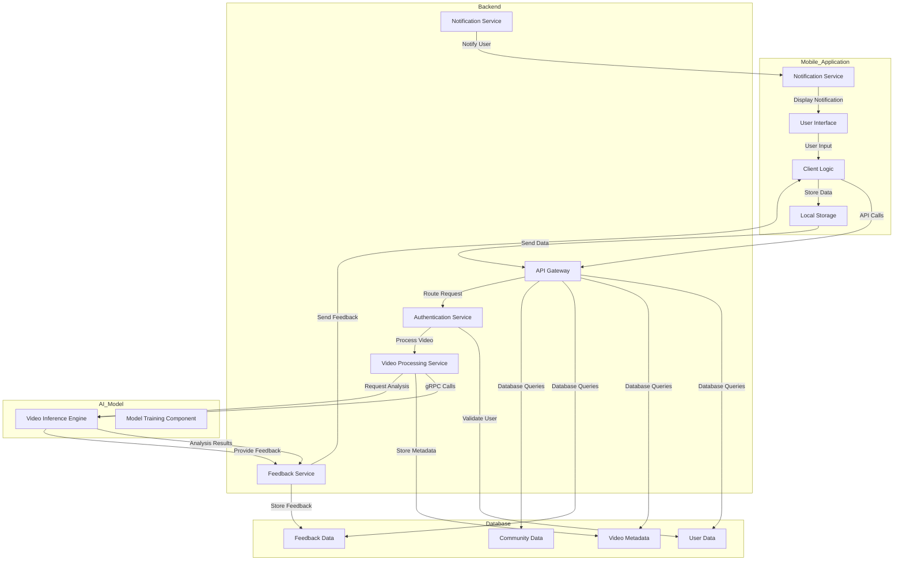
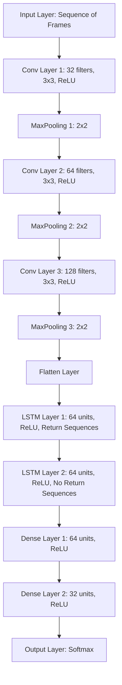

# Technical Specification

### Table of Contents
- [Technical Specification](#technical-specification)
    - [Table of Contents](#table-of-contents)
  - [1. Introduction](#1-introduction)
    - [1.1 Project Overview](#11-project-overview)
    - [1.2 Document Purpose](#12-document-purpose)
    - [1.3 Intended Audience](#13-intended-audience)
    - [1.4 Scope](#14-scope)
  - [2. System Architecture](#2-system-architecture)
    - [2.1 Overview](#21-overview)
    - [2.2 System Architecture Diagram](#22-system-architecture-diagram)
  - [3. AI Model](#3-ai-model)
    - [3.1 Model Development](#31-model-development)
      - [3.1.1 Data Collection](#311-data-collection)
      - [3.1.2 Data Augmentation](#312-data-augmentation)
      - [3.1.3 Data Splitting](#313-data-splitting)
      - [3.1.3 Data Preprocessing](#313-data-preprocessing)
      - [3.1.4 Model Architecture](#314-model-architecture)
    - [3.1.4 Model Architecture](#314-model-architecture-1)
      - [Neural Network Design](#neural-network-design)
      - [Hyperparameters](#hyperparameters)
      - [Model Architecture Diagram](#model-architecture-diagram)
      - [Implementation Outline](#implementation-outline)
      - [3.1.5 Training and Validation](#315-training-and-validation)
      - [3.1.6 Model Evaluation](#316-model-evaluation)
    - [3.2 Model Deployment and Usage](#32-model-deployment-and-usage)
      - [3.2.1 Model Integration](#321-model-integration)
      - [3.2.2 Video Preprocessing for Inference](#322-video-preprocessing-for-inference)
      - [3.2.3 Inference Process](#323-inference-process)
      - [3.2.4 Feedback Generation](#324-feedback-generation)
      - [3.2.5 Continuous Learning](#325-continuous-learning)

---

## 1. Introduction

### 1.1 Project Overview
**Project Name:**
LiftGuard

**Document Title:**
Technical Specification

**Version:**
0.1

**Date:**
July 01, 2024

**Author(s):**
- Quentin CLÉMENT (Project Owner)

---

### 1.2 Document Purpose
This document outlines the technical specifications for the LiftGuard project. It serves as a guide for the development team to understand the technical details, architecture, and implementation plans required to build and maintain the application.

---

### 1.3 Intended Audience
This document is intended for software architects, developers, and testers involved in the LiftGuard project. It provides the necessary technical details to ensure a coherent and efficient development process.

---

### 1.4 Scope
The scope of this document includes detailed technical specifications for the LiftGuard mobile application, server-side application, database, and AI model. It covers the architecture, design, deployment, and testing aspects of the project.

---

## 2. System Architecture

### 2.1 Overview

The LiftGuard system is composed of the following components:

| Component | Description | Technology |
| --- | --- | --- |
| Mobile Application (Frontend) | User interface for interacting with the system | Flutter 3.22.0 |
| Mobile Application (Backend) | Server-side application handling business logic and data processing | Flutter 3.22.0 |
| Database | Storage for user data, video metadata, feedback data, and community data | Firebase |
| AI Model | Video inference engine for analyzing video content | Python 3.10.12 & TensorFlow 2.15.0 |

---

### 2.2 System Architecture Diagram



---

## 3. AI Model

### 3.1 Model Development
This section covers everything related to the development and training of the AI model before it is deployed. It includes details on data collection, preprocessing, training, and validation.

#### 3.1.1 Data Collection
Creating a comprehensive dataset is crucial but challenging. Developing a dataset with a diverse range of individuals, varying body types, and different equipment is time-consuming and costly. Given the number of specific errors we aim to detect, there are no existing datasets that fully meet our requirements.

Due to time and budget constraints, a compromise is necessary. Therefore, we will create a dataset featuring three different individuals, with each person recording five videos for each following case:
- ✅ Correct
- ❌ Knee Cave (Valgus Collapse)
- ❌ Heels Lifting
- ❌ Depth

To maximize the diversity of the dataset, each video will be recorded under varying conditions:
- Different video lengths (ranging from 2 to 10 seconds)
- Different cameras (each individual will use a different smartphone with different camera specifications)
- Different angles (all within the optimal green area of the image below)
- Different exercise speeds (to account for variations in the speed of performing the squats)


The objective is to reproduce as many real-world scenarios as possible to ensure the AI model can generalize well to diverse situations encountered in production.

#### 3.1.2 Data Augmentation
Because we can't afford to record an infinite number of videos, we will use data augmentation techniques to artificially increase the size of our dataset and simulate variations in the input data. The following data augmentation techniques will be applied:
- **Flipping**: Horizontally flip the video frames to simulate the mirror image of the squat.
  - **Multiplication Factor:** 1 time per video (flipping once doubles the dataset).
- **Adjusting Brightness**: Randomly adjust the brightness of the video frames to account for different lighting conditions.
  - **Multiplication Factor:** 2 times per video (adjusting brightness to lower and higher levels).
- **Color Jittering**: Randomly adjust the color of the video frames to simulate variations in the camera settings.
  - **Multiplication Factor:** 2 times per video (adjusting colors to create different hues and saturations).
- **Gaussian Noise**: Add Gaussian noise to the video frames to simulate noise in the input data.
  - **Multiplication Factor:** 2 times per video (adding noise at two different intensities).
- **Salt and Pepper Noise**: Add salt and pepper noise to the video frames to simulate noise in the input data.
  - **Multiplication Factor:** 2 times per video (adding noise at two different intensities).

Using these techniques, each original video can be augmented up to 16 times, significantly expanding the dataset while maintaining realistic variations.

#### 3.1.3 Data Splitting

- Training Set:
  - Ratio: 80% of the dataset
  - Number of Videos: 768 videos
  - Videos per Label: 192 videos per label

- Validation Set:
  - Ratio: 10% of the dataset
  - Number of Videos: 96 videos
  - Videos per Label: 24 videos per label

- Testing Set:
  - Ratio: 10% of the dataset
  - Number of Videos: 96 videos
  - Videos per Label: 24 videos per label

#### 3.1.3 Data Preprocessing

**<u>➭ Image Resizing:</u>** \
To ensure all videos have a consistent size and aspect ratio for input into the model, we will standardize the images to a resolution of 640x480 pixels with a 4:3 aspect ratio. This involves resizing images that are too big, too small, or have different aspect ratios.

1. **Determine the Original Aspect Ratio:**

    Calculate the aspect ratio of the input image by dividing its width by its height.

2. **Images with Correct Aspect Ratio (4:3):**

    Directly resize the image to 640x480 pixels using interpolation.

3. **Images with Aspect Ratio Less than 4:3:**
   - **Padding:** 
     - Scale the height to 480 pixels.
     - Calculate the width to maintain the 4:3 aspect ratio
     - Add black padding to the sides to reach the new width of 640 pixels.
   - **Resize:** Resize the padded image to 640x480 pixels.

4. **Images with Aspect Ratio Greater than 4:3:**
   - **Cropping:** 
     - Scale the width to 640 pixels.
     - Calculate the height to maintain the 4:3 aspect ratio
     - Crop the sides to reduce the width to 640 pixels.
   - **Resize:** Resize the cropped image to 640x480 pixels.

**<u>➭ Frame Extraction:</u>** \
This step will be performed using the OpenCV library to extract frames from the video files. The frame extraction process will be configured to capture frames at a fixed frame rate of 30 frames per second to ensure consistency across all videos. The standard length of each video will be 5 seconds, resulting in 150 frames per video.

**<u>➭ Handling Different Video Lengths:</u>**
- **Shorter Videos:** If a video is shorter than the standard length, duplicate the last frame until the video reaches the standard number of frames.
- **Longer Videos:** If a video is longer than the standard length, in the app, the user will have to select the 5-second segment to analyze.

**<u>➭ Normalization:</u>** \
To ensure the model's input data is consistent and standardized, we will normalize the pixel values of the frames to a range of [0, 1]. This normalization process involves dividing the pixel values by 255 (the maximum pixel value in an 8-bit image).

**<u>➭ Label Encoding:</u>** \
The labels for each video will be encoded into numerical values to facilitate model training. The following encoding scheme will be used:
- **Correct:** 0
- **Knee Cave (Valgus Collapse):** 1
- **Heels Lifting:** 2
- **Depth:** 3

#### 3.1.4 Model Architecture
### 3.1.4 Model Architecture

The architecture of the AI model used for analyzing squat exercises is critical for achieving high accuracy and reliability. This section outlines the design of the neural network, including the types of layers used, their configurations, and the key hyperparameters for training.

#### Neural Network Design

The AI model is designed to process sequences of frames extracted from videos. Given the sequential nature of the data, a combination of Convolutional Neural Networks (CNNs) and Long Short-Term Memory (LSTM) networks is employed. The CNN layers extract spatial features from each frame, while the LSTM layers capture the temporal dynamics across the sequence of frames.

1. **Input Layer:**
   - The input layer receives a sequence of frames. Each frame is a 640x480 image with 3 color channels (RGB).

2. **Convolutional Layers:**
   - **First Convolutional Layer:** 
     - Filters: 32
     - Kernel Size: (3, 3)
     - Activation: ReLU
     - Pooling: MaxPooling (2, 2)
   - **Second Convolutional Layer:**
     - Filters: 64
     - Kernel Size: (3, 3)
     - Activation: ReLU
     - Pooling: MaxPooling (2, 2)
   - **Third Convolutional Layer:**
     - Filters: 128
     - Kernel Size: (3, 3)
     - Activation: ReLU
     - Pooling: MaxPooling (2, 2)

3. **Flatten Layer:**
   - After the convolutional layers, the 3D feature maps are flattened into 1D vectors.

4. **LSTM Layers:**
   - **First LSTM Layer:**
     - Units: 64
     - Activation: ReLU
     - Return Sequences: True
   - **Second LSTM Layer:**
     - Units: 64
     - Activation: ReLU
     - Return Sequences: False

5. **Dense Layers:**
   - **First Dense Layer:**
     - Units: 64
     - Activation: ReLU
   - **Second Dense Layer:**
     - Units: 32
     - Activation: ReLU

6. **Output Layer:**
   - Units: Number of classes (e.g., 4 for Correct, Knee Cave, Heels Lifting, Depth)
   - Activation: Softmax

#### Hyperparameters

The key hyperparameters used during training significantly influence the performance of the model. The chosen values are based on empirical results and best practices for training neural networks.

- **Learning Rate:** 0.001
- **Batch Size:** 32
- **Number of Epochs:** 50
- **Optimizer:** Adam
- **Loss Function:** Categorical Cross-Entropy
- **Dropout Rate:** 0.5 (to prevent overfitting)

#### Model Architecture Diagram

Here's a high-level diagram of the model architecture:



#### Implementation Outline

The implementation of the model can be done using TensorFlow and Keras. Below is an outline of the implementation:

```python
from tensorflow.keras.models import Sequential
from tensorflow.keras.layers import Conv2D, MaxPooling2D, Flatten, LSTM, Dense, TimeDistributed, Dropout
from tensorflow.keras.optimizers import Adam

# Define the model
model = Sequential()

# Add convolutional layers
model.add(TimeDistributed(Conv2D(32, (3, 3), activation='relu'), input_shape=(None, 480, 640, 3)))
model.add(TimeDistributed(MaxPooling2D((2, 2))))
model.add(TimeDistributed(Conv2D(64, (3, 3), activation='relu')))
model.add(TimeDistributed(MaxPooling2D((2, 2))))
model.add(TimeDistributed(Conv2D(128, (3, 3), activation='relu')))
model.add(TimeDistributed(MaxPooling2D((2, 2))))
model.add(TimeDistributed(Flatten()))

# Add LSTM layers
model.add(LSTM(64, activation='relu', return_sequences=True))
model.add(LSTM(64, activation='relu', return_sequences=False))

# Add dense layers
model.add(Dense(64, activation='relu'))
model.add(Dropout(0.5))
model.add(Dense(32, activation='relu'))
model.add(Dropout(0.5))

# Add output layer
model.add(Dense(4, activation='softmax'))

# Compile the model
model.compile(optimizer=Adam(learning_rate=0.001), loss='categorical_crossentropy', metrics=['accuracy'])

# Summary of the model
model.summary()
```

It is important to note that the model architecture and hyperparameters may be subject to change based on the results of training and validation.

#### 3.1.5 Training and Validation
- **Training Process:** Explain the training process, including the loss function, optimization algorithm, and any regularization techniques used.
- **Validation:** Describe how the model is validated, including the use of validation datasets and performance metrics (e.g., accuracy, precision, recall).

#### 3.1.6 Model Evaluation
- **Performance Metrics:** Provide details on the performance metrics used to evaluate the model’s accuracy and reliability.
- **Cross-Validation:** Explain any cross-validation techniques used to ensure the model's generalizability.
- **Final Model Selection:** Describe the criteria for selecting the final model for deployment.

---

### 3.2 Model Deployment and Usage
This section covers how the trained AI model is integrated into the application, including preprocessing user-uploaded videos, running inference, and generating feedback.

#### 3.2.1 Model Integration
- **Deployment Environment:** Describe the environment in which the model is deployed, including the use of TensorFlow Serving or other deployment frameworks.
- **API Integration:** Explain how the model is integrated with the backend API to handle video analysis requests.

#### 3.2.2 Video Preprocessing for Inference
- **User Video Upload:** Detail the process of handling video uploads from users, including file format and size limitations.
- **Frame Extraction:** Explain how frames are extracted from user-uploaded videos for analysis.
- **Normalization:** Describe the normalization process applied to these frames to ensure consistency with the training data.

#### 3.2.3 Inference Process
- **Inference Request:** Detail how the backend sends frames to the model for inference using gRPC or REST APIs.
- **Real-Time Processing:** Explain any real-time processing capabilities, such as how quickly the model processes frames and returns results.

#### 3.2.4 Feedback Generation
- **Output Interpretation:** Describe how the model's output is interpreted to generate user-friendly feedback, including the types of errors detected and confidence scores.
- **Feedback Presentation:** Explain how feedback is presented to the user within the mobile application, including any visualization tools used.

#### 3.2.5 Continuous Learning
- **Model Retraining:** Detail the process for continuously improving the model by retraining it with new data, including how new labeled data is collected and integrated.
- **User Feedback Loop:** Explain how user feedback is incorporated into the model improvement process.